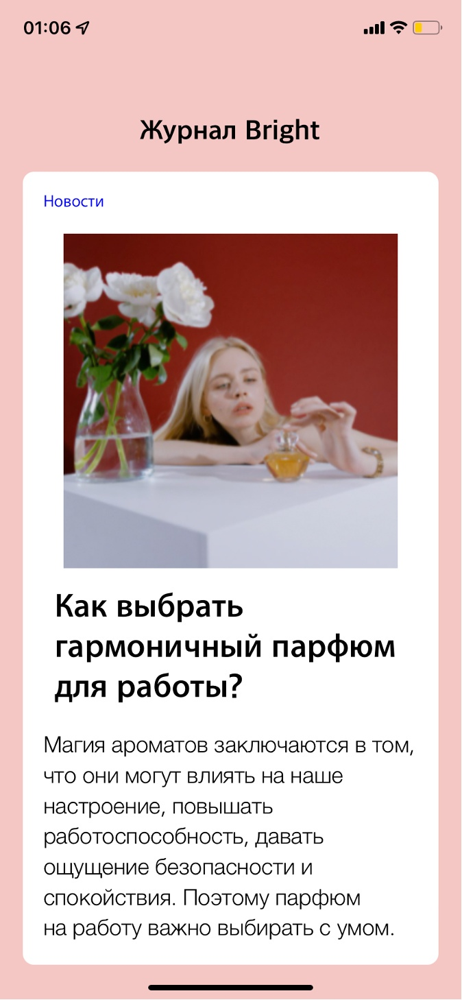

# Стили в React Native
## Цель работы
Получить навыки работы со стилями в React Native.  
## Задания для выполнения
Используя стартовый шаблон https://snack.expo.io/ оформите контент таким же образом:  
  
Загрузить созданную программу на GitHub в репозиторий Student, используя формат в названии Фамилия (латинскими буквами)_1.  
## Контрольные вопросы
Приведите аналоги тегов html в React Native:
div - view, для разделения экрана
input - textinput, для ввода текста
video - добавляет на страницу видео-файлы
button - в react native такой же тег для создания объекта кнопки
Приложение:  
  
Код:  
import React from 'react';
import { StyleSheet, Text, View, Image } from 'react-native';

const Journal = () => {
  return(
    <View style={{backgroundColor:'#f5c7c4', height:'100%'}}>
      <Text style={styles.journalName}>Журнал Bright</Text>
      <View style={styles.container}>
        <Text style={styles.link}>Новости</Text>
        <Image style={{width: 300, height: 300, alignSelf:'center'}} source={require('./assets/picture.png')}/>
        <Text style={styles.title}>Как выбрать гармоничный парфюм для работы?</Text>
        <Text style={styles.maintext}>Магия ароматов заключаются в том, что они могут влиять на наше настроение, повышать работоспособность, давать ощущение безопасности и спокойствия. Поэтому парфюм на работу важно выбирать с умом.</Text>
      </View>
    </View>

  );

};

const styles = StyleSheet.create({
  container:{
    marginEnd:'5%',
    marginStart:'5%',
    borderRadius:10,
    backgroundColor:'white'
  },
  maintext: {
    fontSize:20,
    marginBottom:'5%',
    alignSelf:'center',
    marginHorizontal:'5%',
    fontFamily:'Avenir-Light'
  },
  title:{
    fontSize:30,
    fontWeight: 'bold',
    alignSelf:'center',
    marginHorizontal:'5%',
    marginVertical:'5%',
    fontFamily:'Apple SD Gothic Neo'
  },
  journalName:{
    fontSize:25,
    fontWeight:'bold',
    marginTop:'25%',
    marginBottom:'5%',
    alignSelf:'center',
    fontFamily:'Apple SD Gothic Neo'
  },
  link:{
    color: 'blue',
    fontSize:15,
    marginStart:'5%',
    marginVertical:'5%',
    fontFamily:'Apple SD Gothic Neo'
  },
});

export default Journal;

