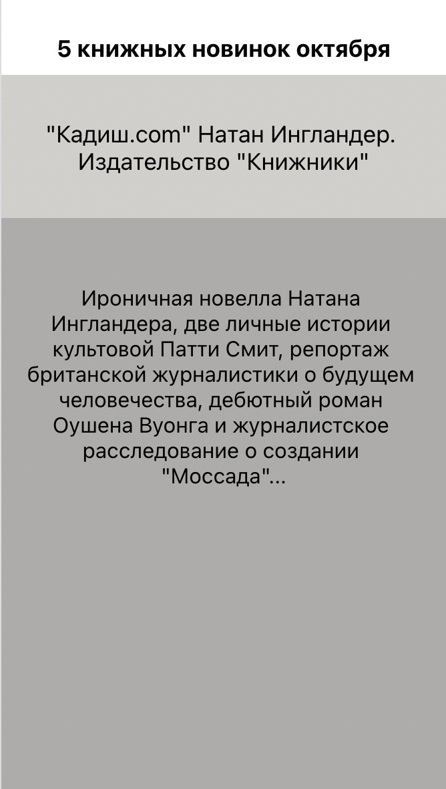

# Гибкие элементы в React Native

## Цель работы

Получить навыки работы с адаптивными объектами в React Native.

## Задания для выполнения

Используя официальную документацию https://reactnative.dev/docs/height-and-width повторите:  
  
Загрузить созданную программу на GitHub в репозиторий Student, используя формат в названии Фамилия (латинскими буквами)\_2.

## Контрольные вопросы

Как в React Native сделать объекты фиксированной ширины и длины?  
С помощью атрибута height задают длину и width - ширину, если в пропорциях, то можно использовать flex
Приложение:

Код:  
import React from 'react';
import { View, Text } from 'react-native';

const FixedDimensionsBasics = () => {
return (
<View style={{flex:1}}>
<View style={{flex:3}}>
<Text style={{alignSelf:'center', marginTop:'10%', fontWeight:'bold',fontSize:'110%'}}>5 книжных новинок октября</Text>
</View>
<View style={{flex:5, backgroundColor: '#d1cfcb'}}>
<Text style={{marginTop:'10%', fontSize:'110%', textAlign: 'center'}}>"Кадиш.com" Натан Ингландер. Издательство "Книжники"</Text>
</View>
<View style={{
        flex:20, backgroundColor: '#adacaa'}}>
<Text style={{marginTop:'10%', fontSize:'100%', textAlign: 'center', padding:'5%'}}>Ироничная новелла Натана Ингландера, две личные истории культовой Патти Смит, репортаж британской журналистики о будущем человечества, дебютный роман Оушена Вуонга и журналистское расследование о создании "Моссада"...</Text>
</View>
</View>
);
};

export default FixedDimensionsBasics;
