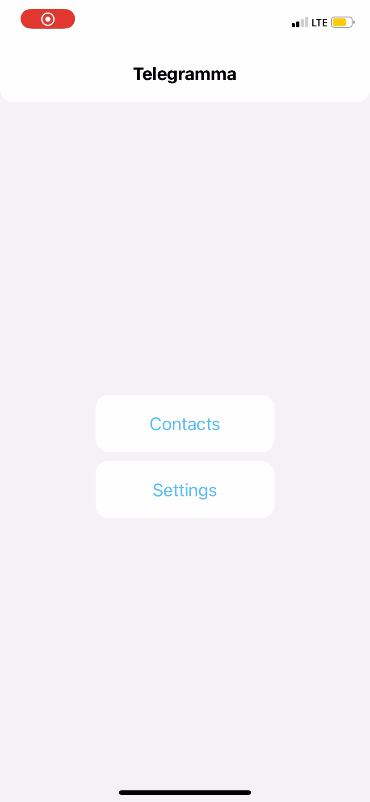

# Навигация в React Native

## Цель работы

В этой работе мы рассмотрим стандартный метод навигации, называемый навигацией по стеку.

## Задания для выполнения

Используя официальную документацию https://reactnative.dev/docs/navigation создайте три экрана вместе с навигайцией по ним.
Добавьте основные компоненты на экраны и создайте книгу контактов, галерею или любое другое простое приложение.

## Контрольные вопросы

Как установить зависимости для управляемого проекта Expo?
Если у вас есть управляемый проект Expo, установите зависимости с помощью expo:
expo install

## Работа программы

